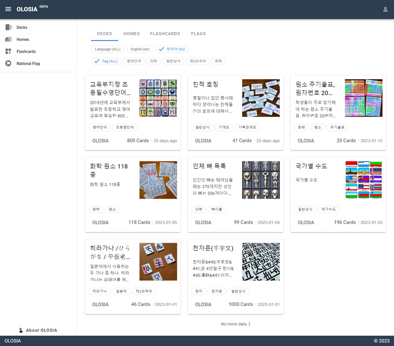
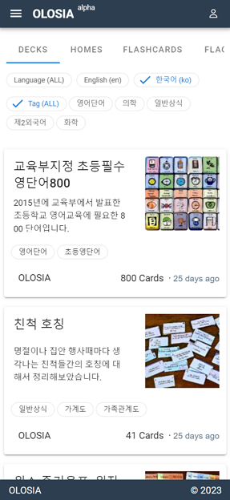
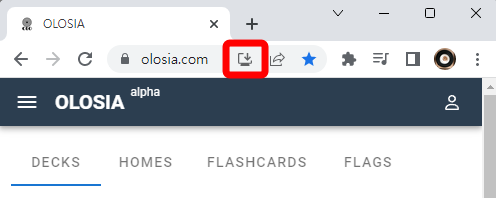

# 👋 Getting started

## Overview

You can create your own flashcards for repetition, or use public flashcards for efficient studying.

If you make your flashcards public, other members can subscribe to them and use them for repetition!

Share your experience and know-how with many people who need it.

[Go to OLOSIA](https://olosia.com)

<figure><figcaption>
PC browser screenshot
</figcaption></figure>

On your mobile phone, your tablet, which is widely used for online lectures, and your PC, OLOSIA is accessible anywhere, anytime!

<figure><figcaption>
Mobile browser screenshot
</figcaption></figure>

## Install app

OLOSIA supports Progressive Web App (PWA) progressively.

When you click on the "Install app" icon in the address bar, as shown in the screenshot below, you can install it so that users can find and use it more easily.

You can also add it to the home screen on Android Chrome to make it easier for users to find and use it.

<figure><figcaption>
Install app
</figcaption></figure>

## How to use

As OLOSIA does not allocate a domain per user, it does not fully support Google AdSense, which is regrettable.

However, we plan to provide limited support for Google AdSense in the official version in the future.

If you operate a blog and have a Google AdSense account, you can publish your AdSense on the study deck that you make public.

We expect that the revisitation rate on the memorization platform will be higher than on a blog, given the nature of the platform.

In the introduction of the public study deck, you are free to include information about your website, blog, and commercial promotion within the scope allowed by our terms and conditions.


It seems that OLOSIA can also be utilized to provide memorization assignments to students in schools and academies.

In the future, we are considering implementing limited sharing functionality by allowing users to set their own public/private settings as a way to thank those who have contributed to the service.

