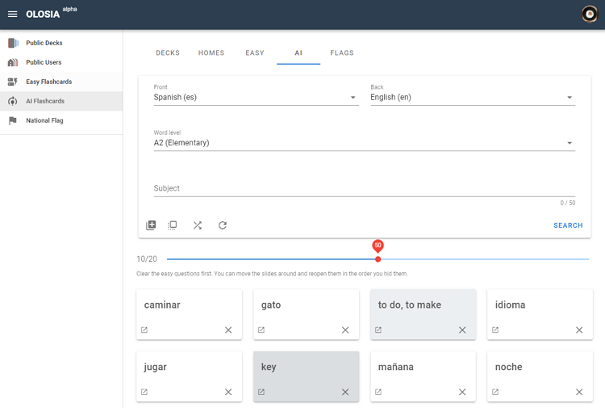

# 🍐 AI Flashcards

Choose the language on the front and back of the card, select the difficulty level of the word, and look it up to get AI-provided flashcards.

With the topic-based generation feature, you can learn more efficiently with words related to the topic.

You can add flashcards that require repetitive learning to the member's memorization book.

[Go to AI Flashcards](https://olosia.com/aicards)


Click on a card to see the answer on the back.

Learn by crossing out familiar words first, and use the slider provided to repeat them.

Features include back first, shuffle, and refresh.

Cards that require repetition can be added to My Memorizer to improve learning efficiency.


<figure><figcaption>
PC browser screenshot
</figcaption></figure>

##
