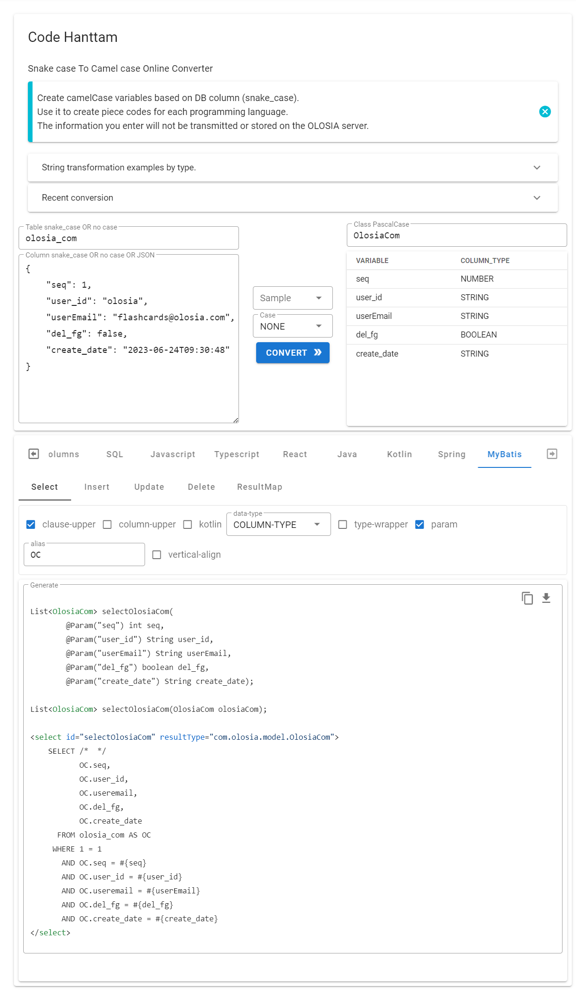

# 🚀 Code Hanttam

We introduce a service that creates camelCase variables based on DB columns (snake\_case).

Use it to create piece codes for each programming language.

The information you enter will not be transmitted or stored on the Olotia server.

[Go to Code Hanttam](https://olosia.com/code-hanttam)

<figure><figcaption><p>PC browser screenshot</p></figcaption></figure>

### Examples of fragment code creation for each programming language

#### Input table column information. <a href="#undefined" id="undefined"></a>

<figure><figcaption><p>Copy Column Excel</p></figcaption></figure>

Copy and enter table column information separated by tabs.

<figure><figcaption><p>Input table column information</p></figcaption></figure>

#### Input Plain text

<figure><figcaption><p>Input Plain text</p></figcaption></figure>

#### Input JSON

<figure><figcaption><p>Input JSON</p></figcaption></figure>

If you select menus and options for each language/function, you can create various pieces of code.


Java Variable

```java
public int seq = 0;	// Sequence
public String userId = null;	// User identification
public String userEmail = null;	// User E-mail
public boolean delFg = false;	// Delete flag
public LocalDateTime createDate = null;	// Date of creation
```

Java Entity

```java
public class OlosiaCom {
	private int seq;
	private String userId;
	private String userEmail;
	private boolean delFg;
	private LocalDateTime createDate;

	public OlosiaCom (int seq, String userId, String userEmail, boolean delFg, LocalDateTime createDate) {
		this.seq = seq;
		this.userId = userId;
		this.userEmail = userEmail;
		this.delFg = delFg;
		this.createDate = createDate;
	}
}
```

Javascript Class

```java
class OlosiaCom {
	constructor(seq, userId, userEmail, delFg, createDate) {
		this.seq = seq;
		this.userId = userId;
		this.userEmail = userEmail;
		this.delFg = delFg;
		this.createDate = createDate;
	}
	getSeq() {
		return this.seq;
	}
	getUserId() {
		return this.userId;
	}
    ...
```

Typescript Variable

```typescript
let seq       : number  = 0    ;	// Sequence
let userId    : string  = ''   ;	// User identification
let userEmail : string  = ''   ;	// User E-mail
let delFg     : boolean = false;	// Delete flag
let createDate: string  = ''   ;	// Date of creation
```

SQL Select

```sql
SELECT /*  */
       seq,
       user_id,
       user_email,
       del_fg,
       create_date
  FROM olosia_com
 WHERE 1 = 1
   AND seq = :seq
   AND user_id = :userId
   AND user_email = :userEmail
   AND del_fg = :delFg
   AND create_date = :createDate
```


### String conversion examples by type

#### PascalCase <a href="#pascalcase" id="pascalcase"></a>

> Transform into a string of capitalized words without separators.

```
"test string" => "TestString"
```

#### camelCase <a href="#camelcase" id="camelcase"></a>

> Transform into a string with the separator denoted by the next word capitalized.

```
"test string" => "testString"
```

#### snake\_case <a href="#snake_case" id="snake_case"></a>

> Transform into a lower case string with underscores between words.

```
"test string" => "test_string"
```

#### CONSTANT\_CASE <a href="#constant_case" id="constant_case"></a>

> Transform into upper case string with an underscore between words.

```
"test string" => "TEST_STRING"
```

#### param-case <a href="#param-case" id="param-case"></a>

> Transform into a lower cased string with dashes between words.

```
"test string" => "test-string"
```

#### Header-Case <a href="#header-case" id="header-case"></a>

> Transform into a dash separated string of capitalized words.

```
"test string" => "Test-String"
```

#### dot.case <a href="#dotcase" id="dotcase"></a>

> Transform into a lower case string with a period between words.

```
"test string" => "test.string"
```

#### path/case <a href="#pathcase" id="pathcase"></a>

> Transform into a lower case string with slashes between words.

```
"test string" => "test/string"
```

#### no case <a href="#no-case" id="no-case"></a>

> Transform into a lower cased string with spaces between words.

```
"testString" => "test string"
```

#### Capital Case <a href="#capital-case" id="capital-case"></a>

> Transform into a space separated string with each word capitalized.

```
"test string" => "Test String"
```

#### Sentence Case <a href="#sentence-case" id="sentence-case"></a>

> Transform into a lower case with spaces between words, then capitalize the string.

```
"testString" => "Test string"
```

#### lower case <a href="#lower-case" id="lower-case"></a>

> Transforms the string to lower case.

```
"TEST STRING" => "test string"
```

#### UPPER CASE <a href="#upper-case" id="upper-case"></a>

> Transforms the string to upper case.

```
"test string" => "TEST STRING"
```

#### lOWER cASE fIRST <a href="#lower-case-first" id="lower-case-first"></a>

> Transforms the string with the first character in lower cased.

```
"TEST" => "tEST"
```

#### Upper Case First <a href="#upper-case-first" id="upper-case-first"></a>

> Transforms the string with the first character in upper cased.

```
"test" => "Test"
```

#### sPoNGe CaSE <a href="#sponge-case" id="sponge-case"></a>

> Transform into a string with random capitalization applied.

```
"Test String" => "tEst stRINg"
```

#### sWAP cASE <a href="#swap-case" id="swap-case"></a>

> Transform a string by swapping every character from upper to lower case, or lower to upper case.

```
"Test String" => "tEST sTRING"
```

#### Title Case <a href="#title-case" id="title-case"></a>

> Transform a string into title case following English rules.

```
"a simple test" => "A Simple Test"
```

\
