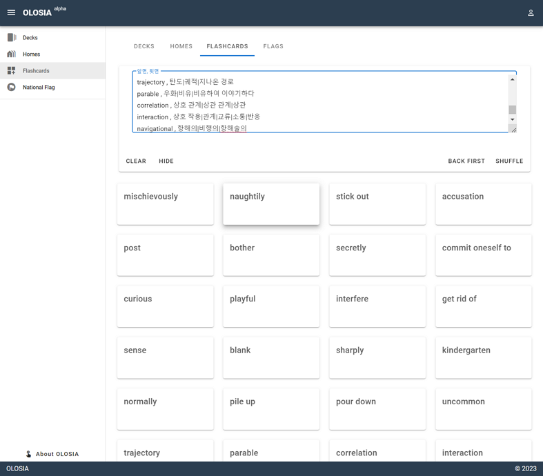
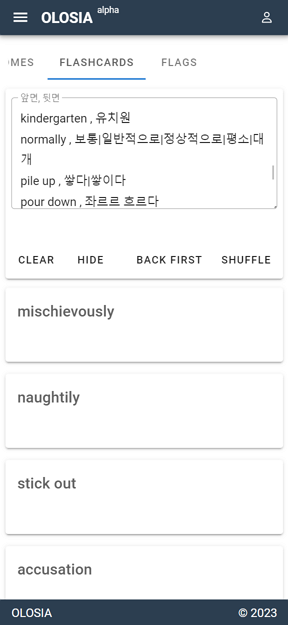

# 🍐 Easy Flashcards

OLOSIA divides the entered content into front and back sides and creates flashcards. On the front side, users can write keywords or questions related to the entered content, and on the back side, they can write the answer or explanation.

Flashcards are widely used for learning, and OLOSIA makes it easy and fast to create flashcards for learning anytime, anywhere.

This simple memorization tool allows users to create their own flashcards easily and quickly for free, even without logging in.

Flashcards can be useful in various fields such as education, certifications, and language learning. Try using OLOSIA now for personal learning or educational purposes!

[Go to Easy Flashcards](https://olosia.com/flashcards)


You can click on the card to see the answer on the back.

Various features such as previewing the back first and shuffling are provided.


<figure><figcaption>
PC browser screenshot
</figcaption></figure>

<figure><figcaption>
Mobile browser screenshot
</figcaption></figure>

##
