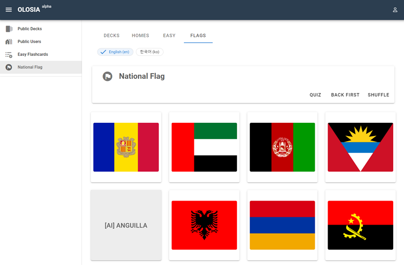
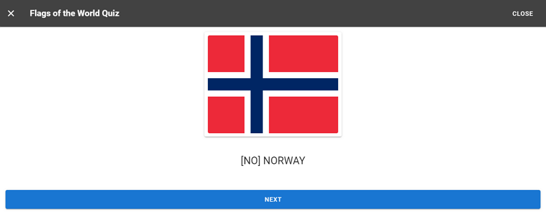

# 🏁 Flags Flashcards

The national flag flashcards are an online learning tool that allows you to learn and practice the flags of various countries around the world. This web service is offered in a flashcard format for guessing the flag, making it easy and fun for anyone to learn about national flags.

By using the service, you can see the flags of various countries in their actual size and proportions, and you can also learn information about each country's flag. In quiz mode, you can take a random flag quiz for more effective learning.

OLOSIA national flag flashcards can be easily used by students and adults alike. Use the national flag flashcard web service to cultivate international understanding and interest!

This feature can be used without signing up for membership.

[Go to Flags Flashcards](https://olosia.com/flags)

<figure><figcaption>
PC browser screenshot
</figcaption></figure>

<figure><figcaption>
Random Quiz screenshot
</figcaption></figure>
