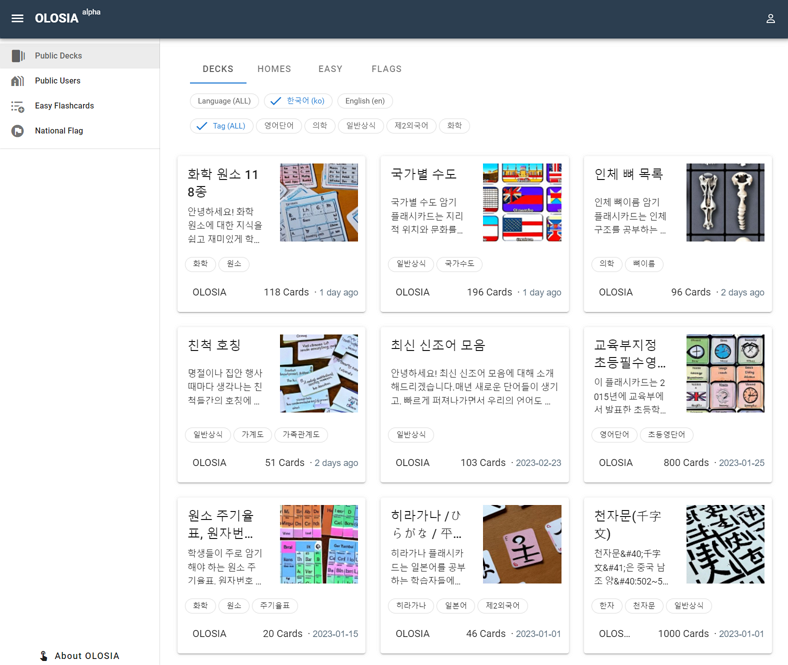

# 🛰 Overview

OLOSIA is a tool that allows users to create flashcards for studying by inputting words or sentences directly. Flashcards are known to be a very effective tool for learning, and with this web service, users can create flashcards by dividing their input into front and back sides.

By making your created flashcards public, more users can visit and use them for studying. Users can select flashcards from various fields and subscribe to them, allowing them to use a variety of flashcards in their desired field.

Flashcards can be useful tools for students, educators, businessmen, and anyone else. OLOSIA can be used on various devices, including mobile and PC, making it available for learning anytime and anywhere.

[Go to OLOSIA](https://olosia.com)

<figure><figcaption>
PC browser screenshot
</figcaption></figure>


Currently, the flashcards are sorted by the latest registration, but in the future, we plan to provide features such as recommended/sorted by views, etc.


### Language-specific

View flashcards that have been shared in different languages.

We plan to add more languages in addition to English and Korean.

### Topic-specific

View flashcards that have been shared based on different topics.

We plan to expand the topics as more content is added to the website.
