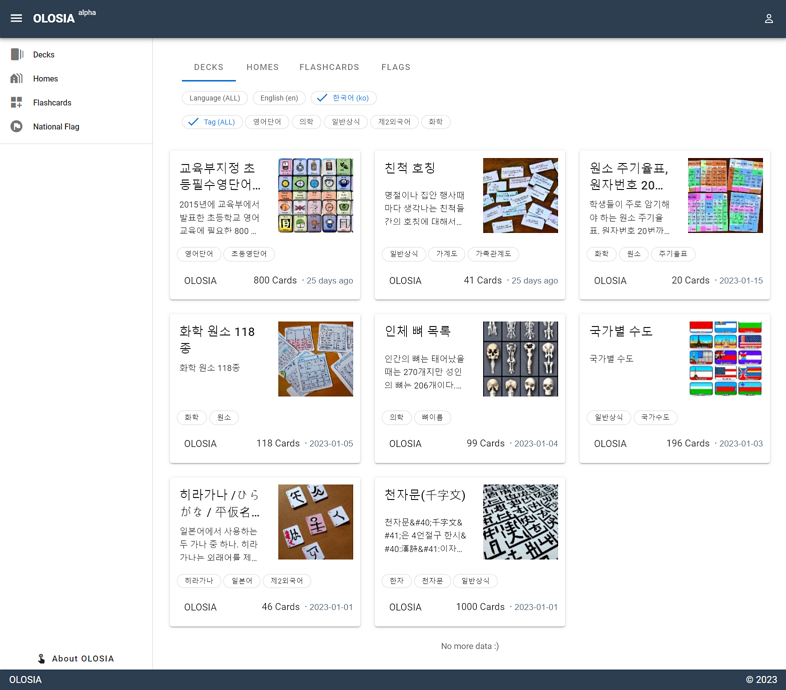

# 🍏 Public Decks

Users can share their knowledge by creating and publishing flashcards on various topics. Other users can then subscribe to these flashcards and utilize them for their own learning. Through this process, users can acquire new knowledge by studying flashcards created by other users on different topics.

[Go to Public Decks](https://olosia.com/decks)


Currently, the flashcards are sorted by the latest registration, but in the future, features such as sorting by recommendation or number of views will be provided.


<figure><figcaption>
PC browser screenshot
</figcaption></figure>

<figure><figcaption>
Mobile browser screenshot
</figcaption></figure>
