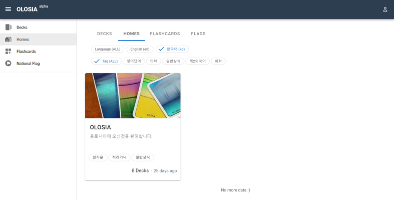

# 🐱 Public Homes

On the public user homepage, you can see users who have made their flashcards public. The user's flashcards are presented in a list format for easy viewing. Additionally, a brief description and introduction are provided for each flashcard listed under its respective topic.

This user homepage is a space where people can share and learn various fields of knowledge together. Visit this user homepage now to grow and learn with a variety of knowledge!

[Go to Public Homes](https://olosia.com/homes)


Currently, it is sorted by the latest registration, but we plan to provide features such as recommended and most viewed in the future.


<figure><figcaption>
PC browser screenshot
</figcaption></figure>

<figure><figcaption>
Mobile browser screenshot
</figcaption></figure>
