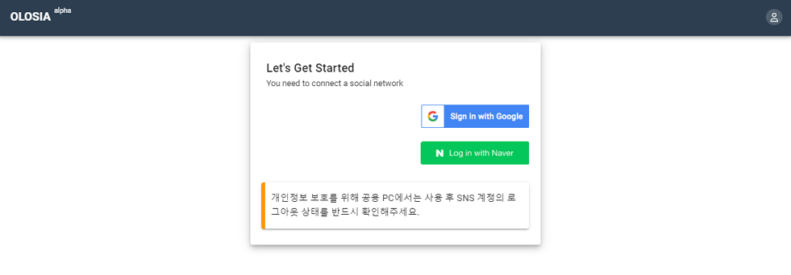
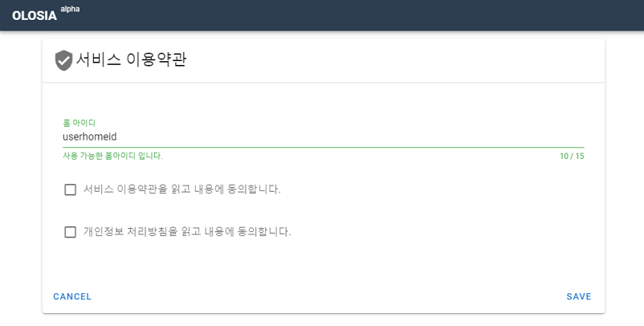

# 🐞 Sign in


To protect your privacy, be sure to check the logout status of your social media accounts after use on a public PC. We recommend using the browser's incognito mode (InPrivate) on public PCs.


<figure><figcaption>
PC browser screenshot
</figcaption></figure>

### Create Account

Enter the home ID you'll use to log in for the first time, agree to the terms, and you're ready to sign up.

<figure><figcaption>
PC browser screenshot
</figcaption></figure>
