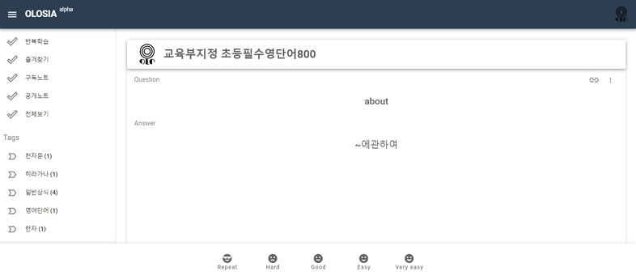

# 🐸 Card Learning Mode

Depending on the difficulty level you select for each card, you can repeat the study on a daily basis afterward.

After checking the questions on the card study screen, click the Answer button at the bottom to check your answers.

You can choose the level of difficulty based on your own judgment, which will determine the number of date cycles that will be repeated.

* Repeat: Repeat the study card again after a while.
* Hard: Repeat again the next day.
* Good: Repeat again in 2-4 days.
* Easy: Repeat again in 6-8 days.
* Very easy: Repeat again in 12 to 16 days.

When you repeat the card-by-card study on a later date, the cycle will be halved or increased depending on the difficulty level you choose.

It's important to keep studying every day if you've designated a memory book as a long-term study.

We will continue to expand and improve the algorithm for the repetition schedule.

<figure><figcaption>
PC browser screenshot
</figcaption></figure>
