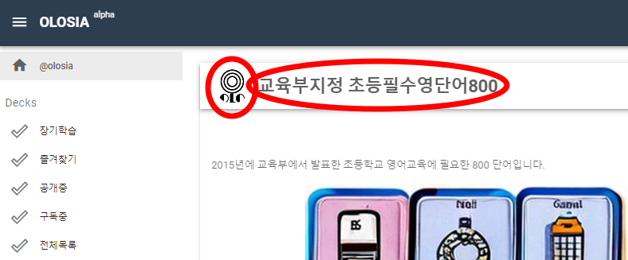

# 🐔 Card

Each card has an individual address, such as https://olosia.com/@olosia/4567/5678.

Click the Answer button at the bottom to see the answer, and the Previous/Next buttons to move to the previous or next card.

You can refer to the information about the question at the URL you registered, via the Reference URL link button in the top right corner.

<figure><figcaption>
PC browser screenshot
</figcaption></figure>

### Navigating to the top menu

In the title section below, clicking the Home icon will take you to Home.

In the card view, clicking on a notebook title will take you to the notebook.

<figure><figcaption>
PC browser screenshot
</figcaption></figure>
