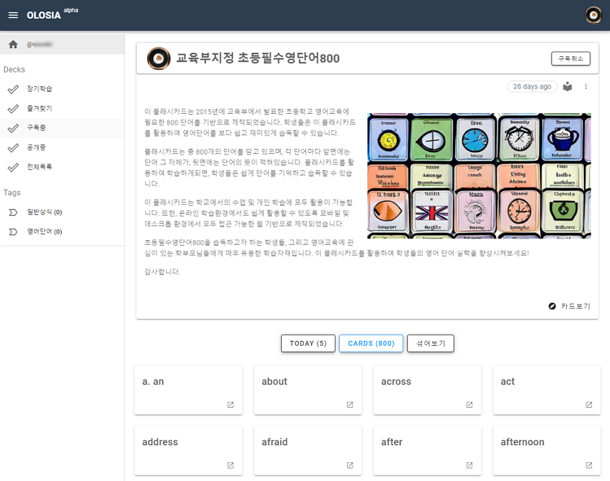
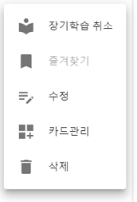
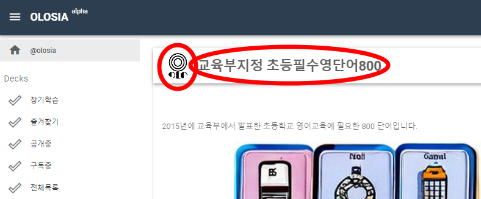

# ⚾ Deck

Each Memory Palace has a separate address, such as [https://olosia.com/@olosia/4567](https://olosia.com/@olosia/4567).

If you set your Memory Palace to public, other users can use your public Memory Palace.

The public Memory Palace can be added to other members' Memory Palace list through the Subscribe button to continue learning.

You can memorize by flipping each card.

<figure><figcaption>
PC browser screenshot
</figcaption></figure>

We provide a function to shuffle the card list using the SHUFFLE button.

You can move to the detailed screen by clicking the detail view button for each individual card.

### Add Card

<figure><figcaption></figcaption></figure>

#### Card addition supports three modes.

* Single Card: Register one card at a time.
* Quick Registration: Write multiple lines of questions/answers for the front and back of the card and register them all at once.
* Excel Registration: Upload an Excel file that contains questions, answers, and explanations for the front and back of the card and register them all at once.

### Deck Management

<figure><figcaption></figcaption></figure>

#### Long-term Learning

You can designate your own memory deck and subscribed memory decks for long-term learning.

Long-term learning is a function that supports daily repetition learning.

#### Favorites

Registered in the favorites menu of the user's home.

#### Edit a Deck

Edit the current deck information.

#### Manage Cards

Download an Excel file of your current deck card information, edit it, and update it in bulk.

#### Delete Deck

Delete the current deck.

### Go to Home

Clicking the home icon in the title section will take you to the home page.

On the card viewing screen, clicking the title of the card deck will take you to the deck.

<figure><figcaption>
PC browser screenshot
</figcaption></figure>
