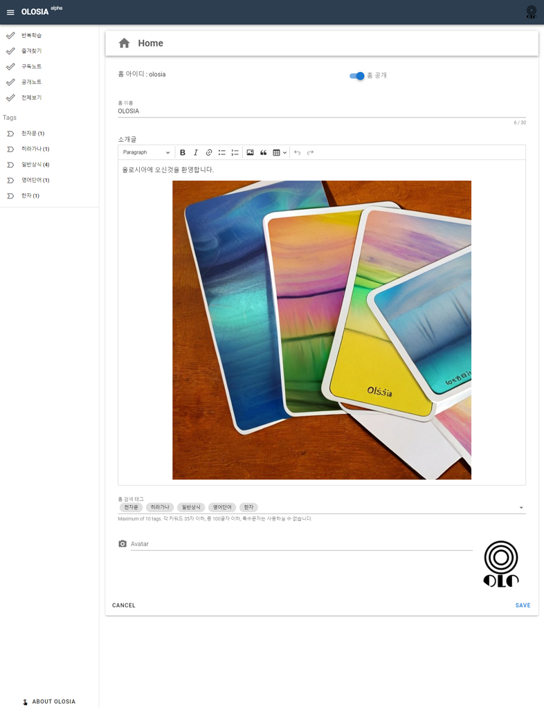

# 🏀 Manage User Home

You can set your homepage name, introduction, tags, avatar, and whether it is public or not.

If you make your homepage public, it will be visible to other users.

The tags you create can also be used as a menu, and when creating a memory deck, you can choose the tags you registered.

You can set up to 10 tags for your homepage.

Visitors can view memory decks by tag categories.

<figure><figcaption>
PC browser screenshot
</figcaption></figure>
