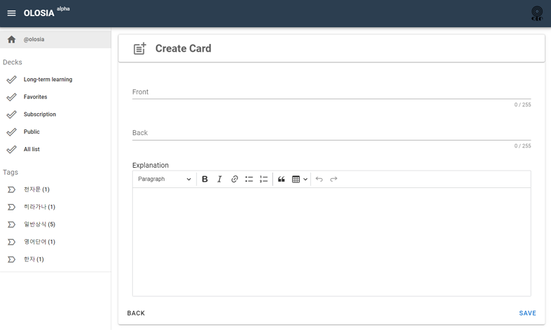
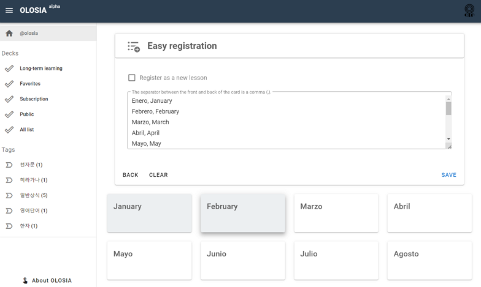
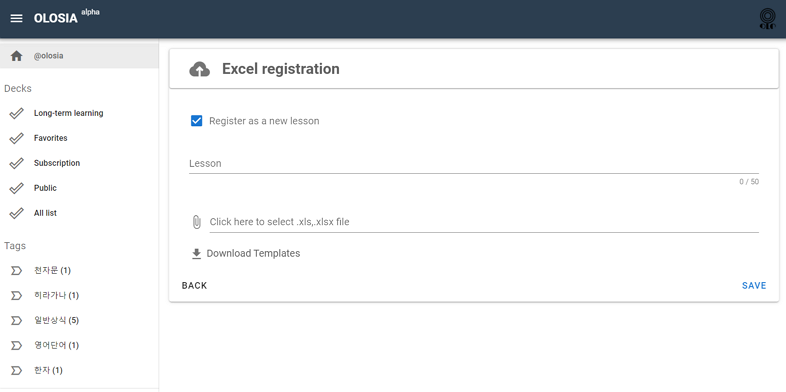
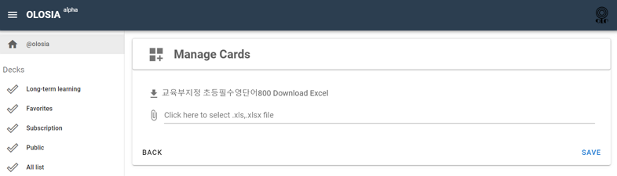

# 🏐 Register Card

<figure><figcaption>
PC browser screenshot
</figcaption></figure>

### Quick Registration

Register at once by writing multiple lines of questions/answers on the front and back of the card.

Questions and answers will be separated by a comma.

<figure><figcaption>
PC browser screenshot
</figcaption></figure>

### Upload an excel

Upload an excel file with the questions, answers, and descriptions for the front and back of the card to register in one go.

Download the Excel Templete file to view the form, fill it out, and register.

<figure><figcaption>
PC browser screenshot
</figcaption></figure>

#### Register as a new lesson

On the Quick Registration / Upload an excel page, there is an option called Register New Lesson.

This is an optional feature that allows you to categorize the list of cards you're bulk registering in your deck into new categories, units, chapters, etc.

If you check Register as a new lesson, an additional optional field called Add Lesson Name will appear.

### Manage Cards

<figure><figcaption>
PC browser screenshot
</figcaption></figure>

You can download an Excel file of your current cards information, edit it, and update it in bulk.

This feature allows you to edit card categorization and contents in bulk.

