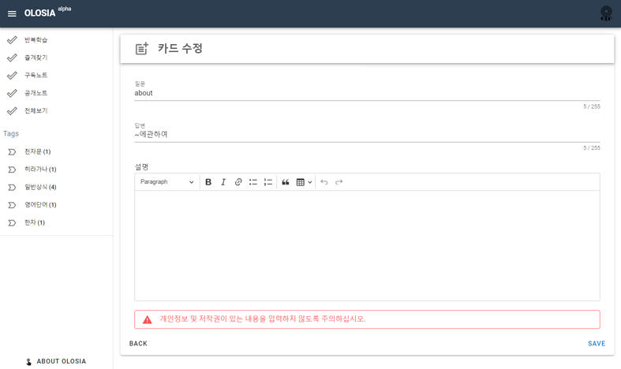
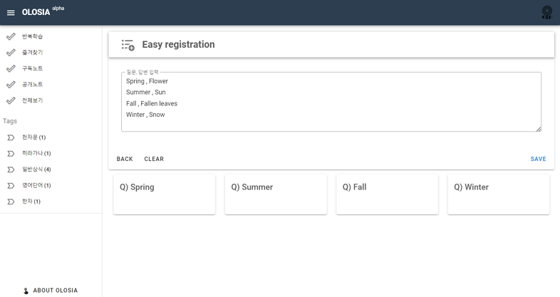
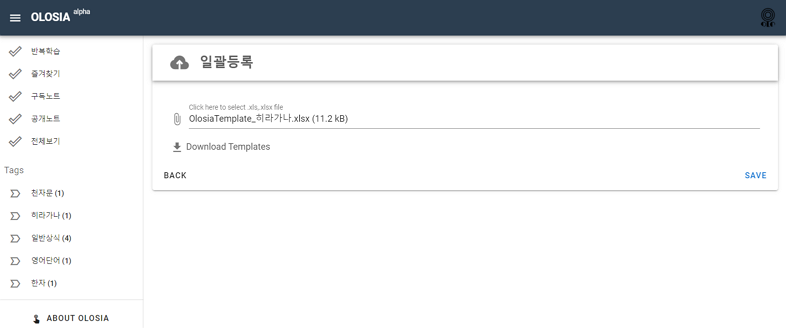

# 🏐 Register Card

<figure><figcaption>
PC browser screenshot
</figcaption></figure>

### Quick Registration

Register at once by writing multiple lines of questions/answers on the front and back of the card.

Questions and answers will be separated by a comma.

<figure><figcaption>
PC browser screenshot
</figcaption></figure>

### Upload an excel

Upload an excel file with the questions, answers, and descriptions for the front and back of the card to register in one go.

Download the Excel Templete file to view the form, fill it out, and register.

<figure><figcaption>
PC browser screenshot
</figcaption></figure>
