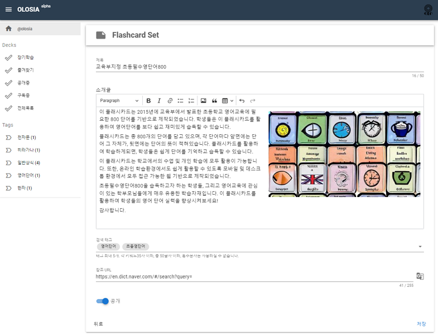

# 🐮 Register Deck

You can set the title, introduction, tags, reference URL, and whether to make it public or not.

You can choose the tags you have registered on your homepage or enter new tags.

The reference URL is provided as a link on the card details page.

> If you search for the word 'word' in Naver English dictionary, you will be directed to the URL below.
>
> https://en.dict.naver.com/#/search?query=word
>
> You can check the URL that switches like this and register only the part before the word you want to search like below.
>
>
>
> NAVER Dictionary
>
> **https://en.dict.naver.com/#/search?query=**
>
> ****
>
> Google Translate
>
> **https://translate.google.co.kr/?text=**

<figure><figcaption>
PC browser screenshot
</figcaption></figure>
