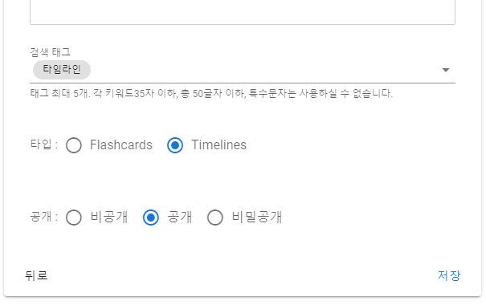
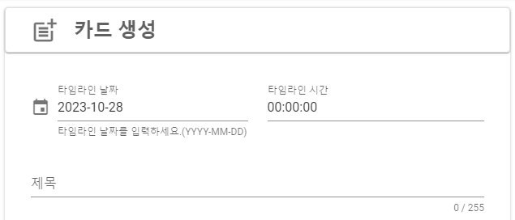
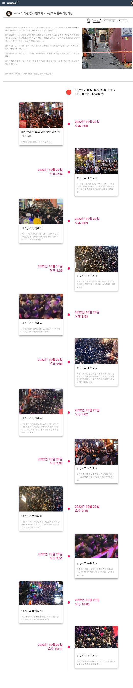

# 🌏 Timeline

### Timeline Management

<figure><figcaption>
PC browser screenshot
</figcaption></figure>

When registering a secret account, specify the type as Timelines.

### Card Management

<figure><figcaption>
PC browser screenshot
</figcaption></figure>

When registering a card, enter the timeline date and time.

When designated as a timeline type, it is displayed in the timeline format below.

<figure><figcaption></figcaption></figure>
