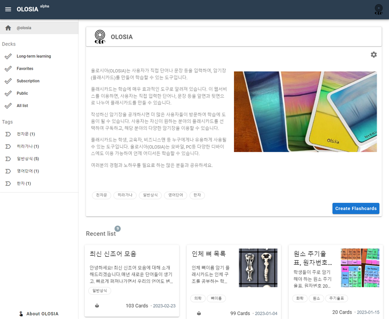

# ⚽ User Home

Each member has an individual address like [https://olosia.com/@olosia](https://olosia.com/@olosia) for their own home.

The home name, introduction, tags, and list of memorization decks are displayed.

If you set your home to public, other users can check your publicly available memorization decks.

If you set it to private, you can only enter your own home after logging in.

You can add a new memorization deck by clicking the "Create Flashcards" button on your home page.

<figure><figcaption>
PC browser screenshot
</figcaption></figure>
